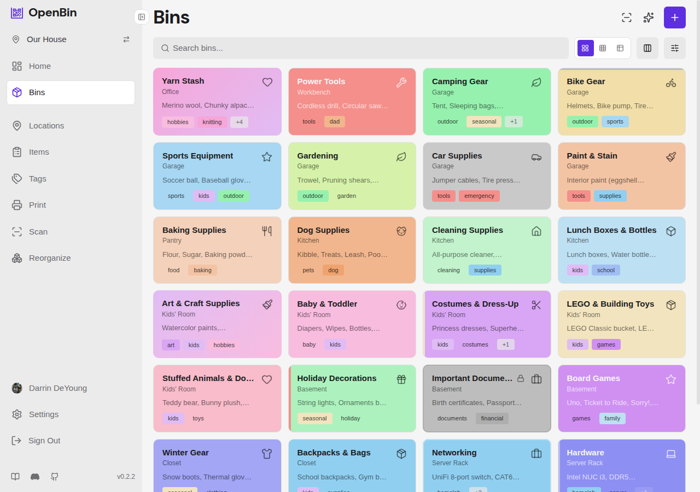

<div align="center">
  <p>
    <a href="https://demo.openbin.app"></a>&nbsp;
    <a href="https://akifbayram.github.io/openbin/"></a>&nbsp;
    <a href="https://github.com/akifbayram/openbin/actions/workflows/ci.yml"></a>&nbsp;
    <a href="https://github.com/akifbayram/openbin/releases/latest"></a>&nbsp;
    <a href="https://discord.gg/W6JPZCqqx9"></a>&nbsp;
  </p>

<picture>
  <source media="(prefers-color-scheme: dark)" srcset="public/logo-horizontal-dark.svg" />
  <source media="(prefers-color-scheme: light)" srcset="public/logo-horizontal.svg" />
  
</picture>

<p>Inventory with intelligence. Organize physical storage bins with QR codes, photo recognition, and multi-user collaboration.</p>


  

</div>

## Features

- **AI assisted autofill** — Capture photos, and the assistant autofills the items in each bin. Bring your own AI.
- **Natural language commands** — "Add batteries to the tools bin" or "Create a bin with widgets x, y, and z".
- **AI reorganization** — Let the assistant suggest how to restructure an entire location's bins, areas, and tags in bulk.
- **Print & scan QR labels** — Generate customizable QR label sheets or name cards, stick them on bins, scan to see contents.
- **MCP server included** — Connect AI assistants directly to your inventory via Model Context Protocol
- **Data portability** — Full JSON/CSV/ZIP export with photos.

## Quick Start

Create a `docker-compose.yml`:

```yaml
services:
  openbin:
    image: ghcr.io/akifbayram/openbin:latest
    ports:
      - "1453:1453"
    volumes:
      - api_data:/data
    environment:
      DATABASE_PATH: /data/openbin.db
      PHOTO_STORAGE_PATH: /data/photos
      BACKUP_PATH: /data/backups

volumes:
  api_data:
```

```bash
docker compose up -d
```

Open `http://localhost:1453`. Register an account, create a location, and start adding bins.

## Configuration

All settings are optional. Set environment variables or create a `.env` file to override defaults. See [`.env.example`](.env.example) for the full list.

<details>
<summary>Environment variables</summary>

| Variable | Description | Default |
|----------|-------------|---------|
| **Server** | | |
| `PORT` | Express server port | `1453` |
| `HOST_PORT` | Docker external port | `1453` |
| `DATABASE_PATH` | SQLite database file path | `./data/openbin.db` |
| `PHOTO_STORAGE_PATH` | Photo upload directory | `./data/photos` |
| `TRUST_PROXY` | Set `true` when behind a reverse proxy | `false` |
| `CORS_ORIGIN` | CORS origin (only needed for non-Docker dev setups) | `http://localhost:5173` |
| **Authentication** | | |
| `JWT_SECRET` | JWT signing secret; auto-generated and persisted if unset | — |
| `ACCESS_TOKEN_EXPIRES_IN` | Short-lived access token lifetime | `15m` |
| `REFRESH_TOKEN_MAX_DAYS` | Refresh token lifetime in days (1–90) | `7` |
| `COOKIE_SECURE` | Force Secure flag on cookies (auto in production) | — |
| `BCRYPT_ROUNDS` | Password hashing rounds (10–31) | `12` |
| `REGISTRATION_MODE` | Registration policy: `open`, `invite` (require location invite code), or `closed` | `open` |
| **Uploads** | | |
| `MAX_PHOTO_SIZE_MB` | Max photo upload size in MB (1–50) | `5` |
| `MAX_AVATAR_SIZE_MB` | Max avatar upload size in MB (1–10) | `2` |
| `MAX_PHOTOS_PER_BIN` | Max photos per bin (1–100) | `1` |
| `UPLOAD_QUOTA_DEMO_MB` | Per-user upload quota in demo mode | `5` |
| `UPLOAD_QUOTA_GLOBAL_DEMO_MB` | Global upload quota in demo mode | `50` |
| **AI (server-wide fallback)** | | |
| `AI_PROVIDER` | `openai`, `anthropic`, `gemini`, or `openai-compatible` | — |
| `AI_API_KEY` | API key for the configured provider | — |
| `AI_MODEL` | Model name (e.g. `gpt-5-mini`, `claude-sonnet-4-6`) | — |
| `AI_ENDPOINT_URL` | Custom endpoint for `openai-compatible` provider | — |
| `AI_ENCRYPTION_KEY` | Encrypts user AI API keys at rest (AES-256-GCM) | — |
| **Backups** | | |
| `BACKUP_ENABLED` | Enable automatic database backups | `false` |
| `BACKUP_INTERVAL` | Backup schedule (hourly/daily/weekly/cron) | `daily` |
| `BACKUP_RETENTION` | Number of backup files to keep (1–365) | `7` |
| `BACKUP_PATH` | Directory for backup files | `./data/backups` |
| `BACKUP_WEBHOOK_URL` | Webhook URL for backup notifications | — |
| **QR Code Payload** | | |
| `QR_PAYLOAD_MODE` | QR encoding mode: `app` (openbin:// URI) or `url` (web URL) | `app` |
| `BASE_URL` | Full URL for `url` mode (e.g. `https://inventory.example.com`) | — |
| **Rate Limiting** | | |
| `AI_RATE_LIMIT` | Max AI requests per hour per user | `30` |
| `AI_RATE_LIMIT_API_KEY` | Max AI requests per hour per API key | `1000` |
| `DISABLE_RATE_LIMIT` | Set `true` to disable all rate limiters (dev only) | `false` |

</details>

## Architecture

Single Node.js process. All data lives in one SQLite file and a photos directory.

| Layer | Technology |
|-------|------------|
| Frontend | React 18, TypeScript, Vite 5, Tailwind CSS 4 |
| Backend | Express 4, SQLite (better-sqlite3), JWT auth |
| Container | Single-stage Alpine image, runs as non-root `node` user |

The `/data` Docker volume contains everything persistent:

```
/data
├── openbin.db        ← single database file (WAL journal)
├── .jwt_secret       ← auto-generated if JWT_SECRET unset
├── photos/           ← uploaded images
└── backups/          ← scheduled DB snapshots (opt-in)
```

## API Documentation

OpenAPI spec at [`server/openapi.yaml`](server/openapi.yaml). See the full [API reference](https://akifbayram.github.io/openbin/api/) in the docs.

## Local Development

**Prerequisites:** Node.js 20+

```bash
npm install                 # Install frontend dependencies
cd server && npm install    # Install server dependencies
```

```bash
npm run dev:all            # Both servers concurrently (recommended)
# Or separately in two terminals:
# cd server && npm run dev   API server at http://localhost:1453
# npm run dev                Frontend dev server at http://localhost:5173
```

## AI Disclosure

Most of this codebase—features, tests, documentation—was written by AI. A human directs architecture, priorities, and design decisions but has not reviewed most code line-by-line. Type checking, linting, and an automated test suite are the primary quality gates.

## License

[AGPL-3.0](LICENSE)
